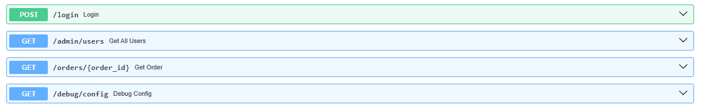
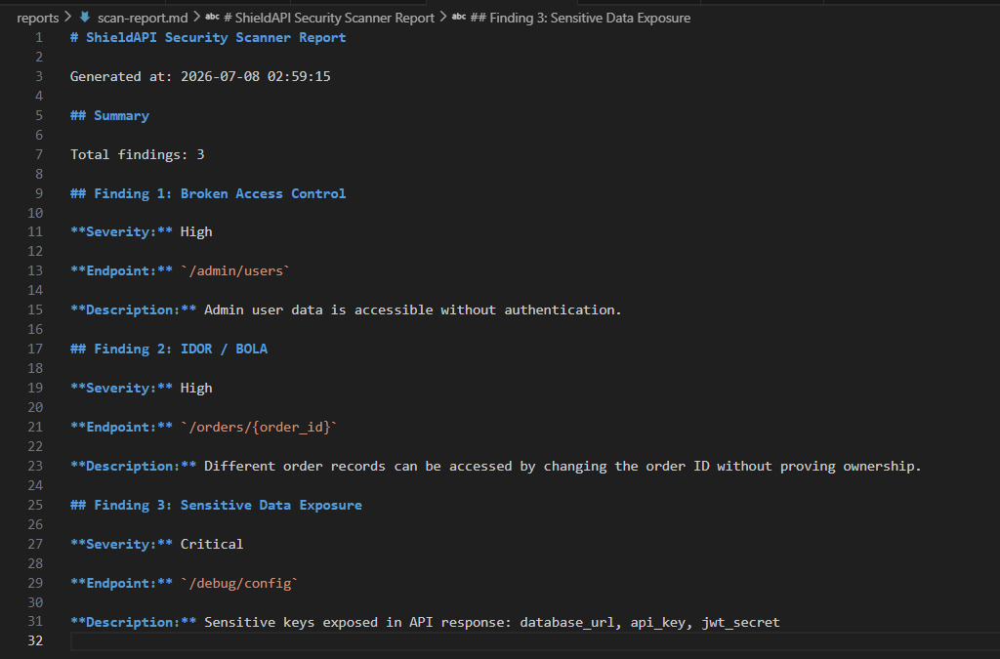

# ShieldAPI

ShieldAPI is a cybersecurity project that demonstrates how vulnerable API endpoints can be detected using a custom Python security scanner.

The project includes:

- A vulnerable FastAPI backend
- Intentional API security vulnerabilities
- A Python-based security scanner
- Markdown scan report generation
- Vulnerability documentation

---

## Project Goal

The goal of this project is to understand common API security issues by building a vulnerable API and then creating a scanner that detects those issues automatically.

This project focuses on defensive security and secure coding awareness.

---

## Features

### Vulnerable API Lab

The backend includes intentionally vulnerable endpoints:

| Vulnerability | Endpoint | Severity |
|---|---|---|
| Broken Access Control | `/admin/users` | High |
| IDOR / BOLA | `/orders/{order_id}` | High |
| Sensitive Data Exposure | `/debug/config` | Critical |

---

### Security Scanner

The scanner checks the vulnerable API and detects:

- Admin data exposed without authentication
- Order data accessed by changing object IDs
- Sensitive configuration data exposed in API responses

The scanner generates a Markdown report at:

```text
reports/scan-report.md
```

---

## Tech Stack

- Python
- FastAPI
- Uvicorn
- Requests
- Git
- Markdown

---

## Project Structure

```text
ShieldAPI/
│
├── backend/
│   └── main.py
│
├── scanner/
│   └── scanner.py
│
├── docs/
│   └── vulnerabilities.md
│
├── reports/
│   └── scan-report.md
│
├── requirements.txt
├── .gitignore
└── README.md
```

---

---

## Screenshots

### FastAPI Documentation



### Security Scanner Report



## How to Run the Project

### 1. Create and activate a virtual environment

```powershell
py -m venv .venv
.\.venv\Scripts\Activate.ps1
```

### 2. Install dependencies

```powershell
pip install -r requirements.txt
```

### 3. Start the API server

```powershell
uvicorn backend.main:app --reload
```

The API will run at:

```text
http://127.0.0.1:8000
```

API documentation:

```text
http://127.0.0.1:8000/docs
```

### 4. Run the scanner

Open a second terminal and run:

```powershell
python scanner\scanner.py
```

The scan report will be saved to:

```text
reports/scan-report.md
```

---

## Vulnerabilities Demonstrated

### OWASP API Security Top 10 Mapping

| Project Finding | Endpoint | OWASP API Security Top 10 2023 Mapping |
|---|---|---|
| IDOR / BOLA | `/orders/{order_id}` | API1:2023 Broken Object Level Authorization |
| Broken Access Control | `/admin/users` | API5:2023 Broken Function Level Authorization |
| Sensitive Data Exposure | `/debug/config` | API8:2023 Security Misconfiguration |

### 1. Broken Access Control

The `/admin/users` endpoint exposes admin data without checking if the user is authenticated or authorized.

### 2. IDOR / BOLA

The `/orders/{order_id}` endpoint allows access to different orders by changing the order ID without verifying ownership.

### 3. Sensitive Data Exposure

The `/debug/config` endpoint exposes sensitive configuration values such as database URLs, API keys, and JWT secrets.

---

## Disclaimer

This project is for educational and defensive cybersecurity learning only.

All vulnerabilities are intentionally created in a local lab environment.


---

## Skills Demonstrated

This project demonstrates practical skills in:

- API security testing
- Vulnerability detection
- Broken Access Control analysis
- IDOR / BOLA testing
- Sensitive data exposure detection
- Python scripting
- FastAPI backend development
- Git and GitHub project management
- Security documentation
- Markdown report generation